## 夏威夷旅行 (2) -- 海龟在沙滩上晒太阳

`r Sys.Date()` written

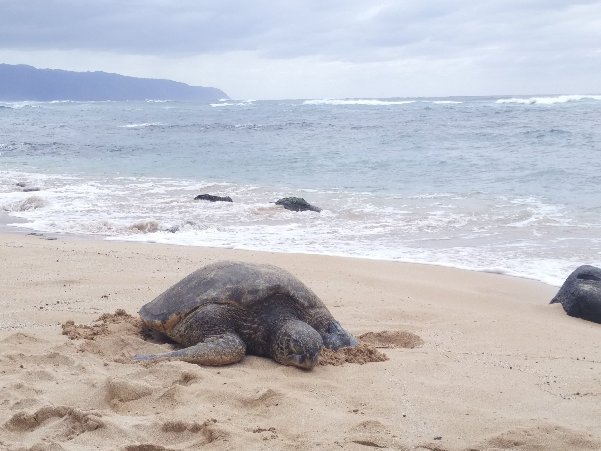

[上回](http://winterwang.github.io/life/2016/06/09/hawaii.html)说到我们一家三口去夏威夷旅行的计划，今天就来说说，我们旅行中详细的体验吧。

### 第一天5月5日

**名古屋中部机场--檀香山国际机场 JL-794 22:05--10:35 实际航行时间8小时32分钟**
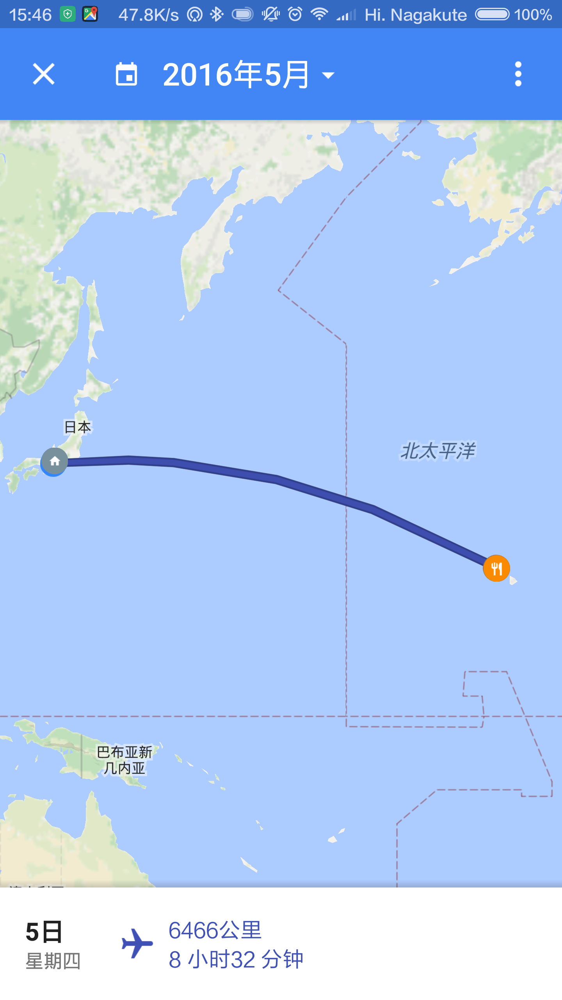
飞机是晚上22:05起飞，我们提前一个多小时抵达机场，停车出关。顺便说一下，这次我申请了美帝的旅游签证，果然给了10年有效期。只是本身护照有效期限是截止2019年。之后如果换了新护照，估计我就要每次都背两本护照了。  
一开始担心小朋友睡不安稳。后来知道是我们想多了。不过一路上轮流抱着小孩睡也是有点累人。
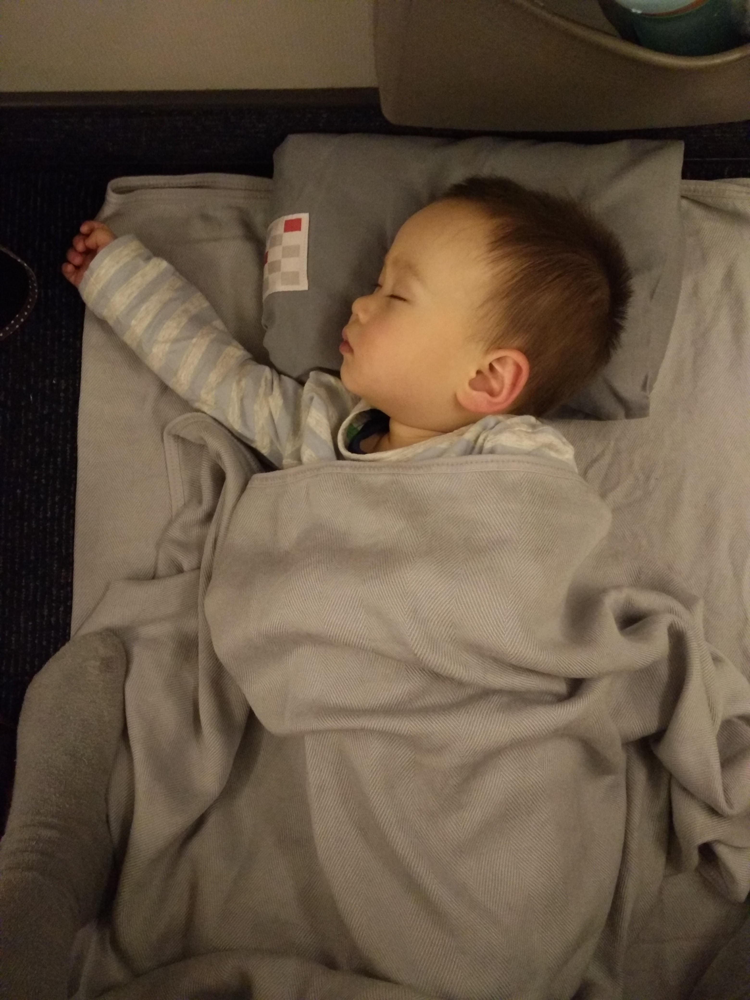  
抵达檀香山机场以后，迅速去找租车公司dollar rental car的机场接送巴士。
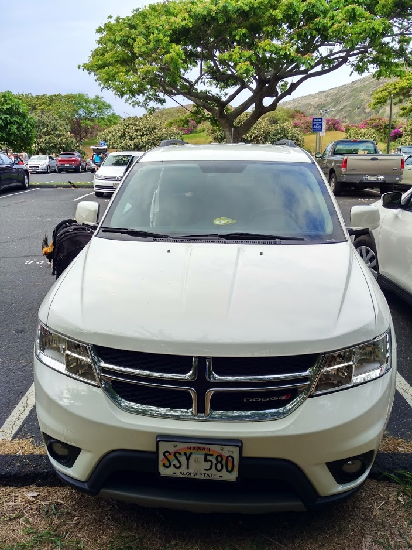  
一路上问了好几个当地人，才找到高架底下跟车牌差不多大小的巴士停靠指示牌。这要是在日本，一定是一路都有箭头指向，不需要开口问任何人的。对待游客的细致和粗犷一目了然。顺利领到车以后便打开查好的[美食地图](https://goo.gl/vqA0wR)想去事先在Yelp上查好的["Ono Hawaiian Foods"](onohawaiianfoods.com)，也是Eri推荐的夏威夷餐厅。 但是可能由于我刚到夏威夷，既不熟悉地形，也还没适应开着的SUV。所以前后按着地址来回开了好几趟，也没看到它的门或者停车场在哪里。失去耐心以后发现离那家餐厅的地址也有点远了，于是把车停到路边去，问了一个路过的老太太，老太太也不清楚，随意就指了指不远处另一家叫做[the nook neighborhood bistro](www.the nookhonolulu.com)的餐厅说那里的汉堡还不错。并且还耐心的指导我们怎么停车。第一顿午饭也是真够折腾的。到当地时间快1点了才开始点菜。

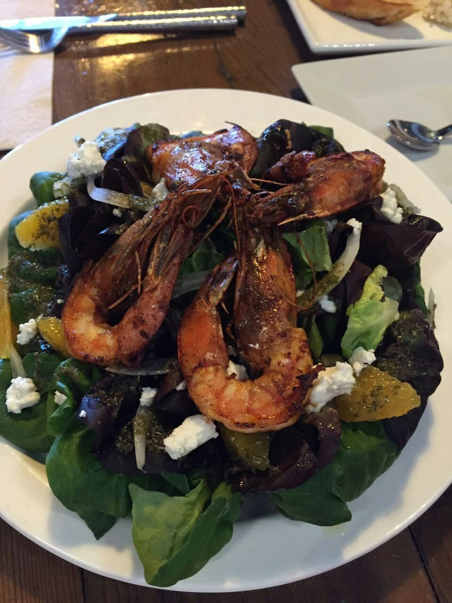
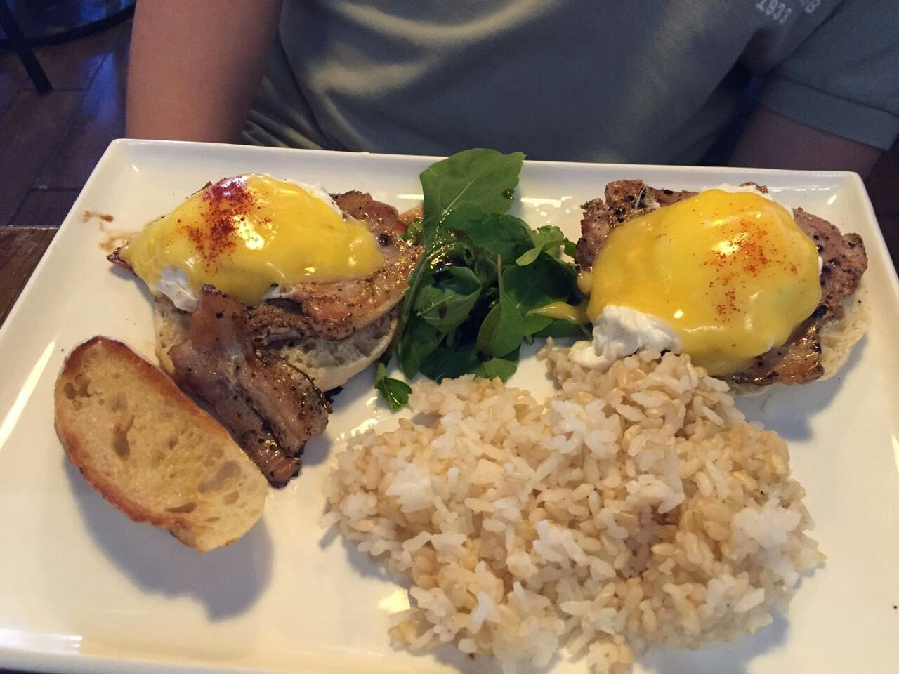

老婆对这大虾还比较满意。特别是对日本没吃到过的，美帝才有的这些蔬菜类赞不绝口。（$35, 加消费）吃好了第一餐，终于抵达我们在夏威夷的临时的家。
不得不说夏威夷我们选的Airbnb的房东真是选的没错。多亏了我老婆。她找了很久才找到既靠近Waikiki又不太贵，而且还能讲日语的Eri一家。那里是个很大的公寓楼，Eri到楼下来非常亲切地告诉我们怎么停车，怎么每天找门口的保安结算停车费和进出时的注意点，然后带我们乘电梯直上30楼他们的房间。从30楼的窗户看出去就是夏威夷靠山一侧的城市景观，也能看到夏威夷大学。不得不再提一下，Eri她们这里的客人停车24小时才5美金，比起动辄30美金一天的其他大酒店真是划算。

到了Eri家以后，小朋友倒不过时差睡着了，原本想说直接去Waikiki闹市区走走以及magic island看看日落, 参观Iolani Palace的计划就瞬间泡汤了。趁有时间又回顾了一遍自己的计划给Eri听，Eri又新推荐了比如[Chief's Luau](http://www.chiefsluau.com/)和夏威夷动物园等等。我们订机票时从日航获得了一小本优惠券，我出发前专门花时间标注了感兴趣的餐厅。这一日等到熊宝睡醒已是7点多，我们只好尝试从住处步行到Waikiki商业区去[Bills Sydney餐厅](http://www.billshawaii.com/)。

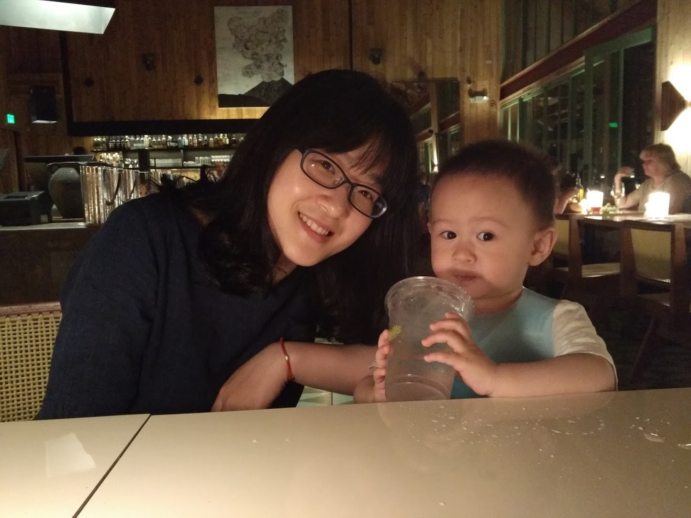
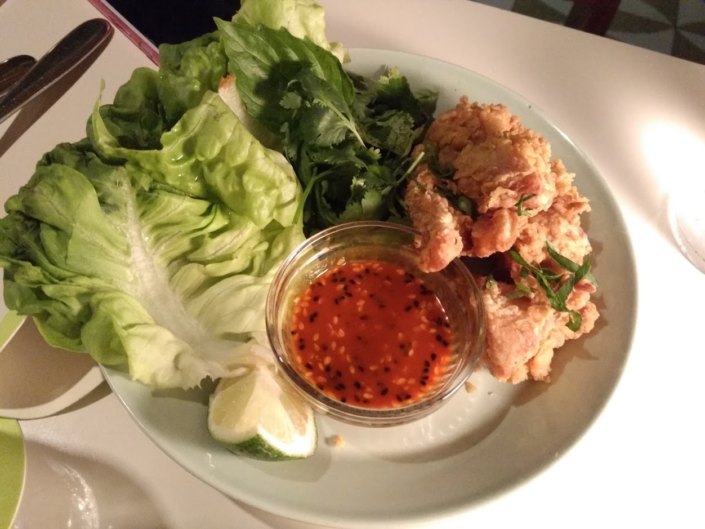
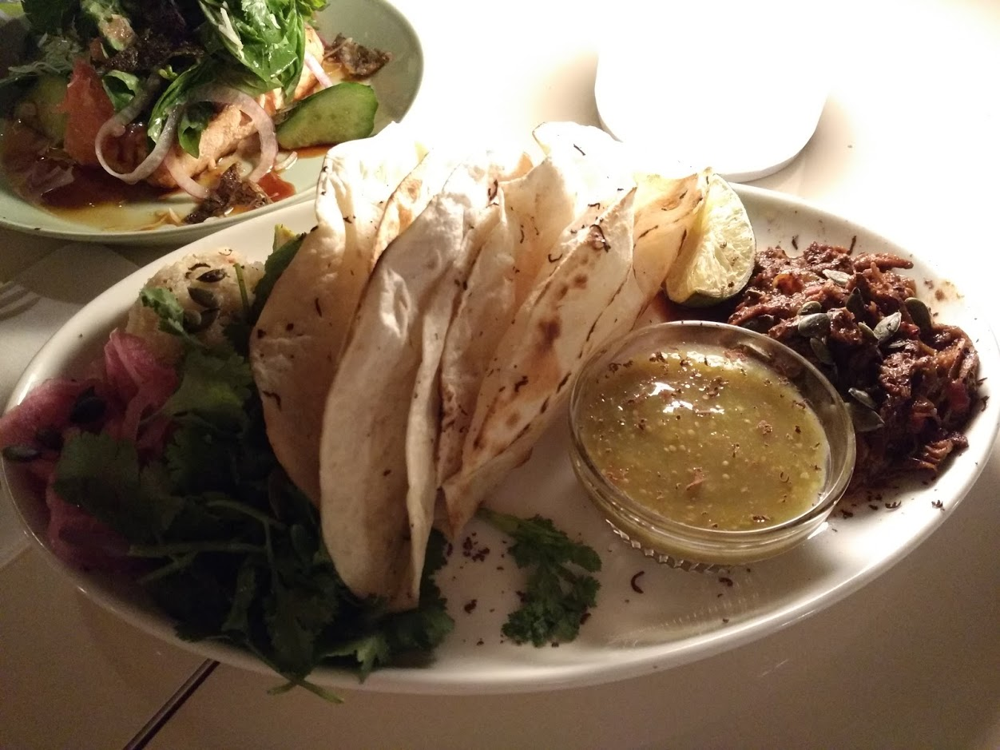
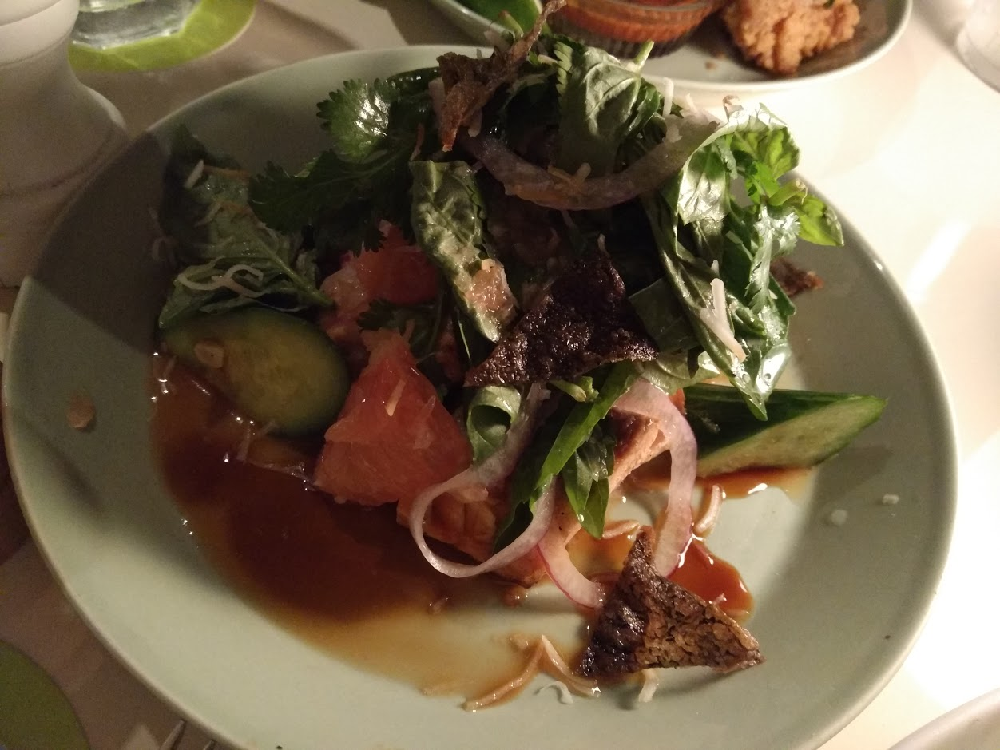

点了三道菜，一共$47.12 + tips $7.88 = $55美金。有点小贵。而且这里小费费率都在15%以上。真是出血啊。。

吃完晚饭以后趁着夜色穿过一家未知酒店，竟然就不知不觉间就来到了[Waikiki海滩](https://goo.gl/maps/uE8VTaKbDqH2)。

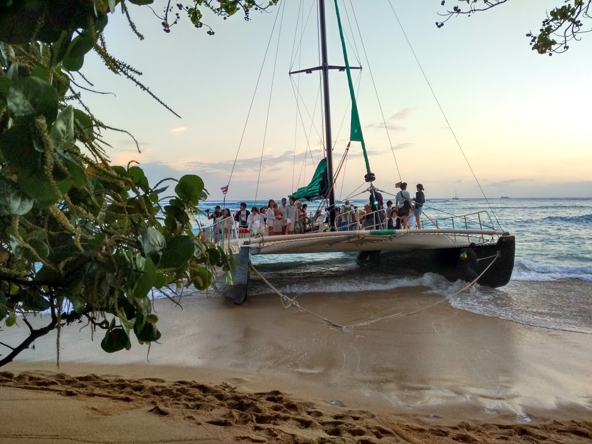  
可以看到这酒店任性地把泳池建在海岸边上，远看在泳池里的人仿佛也在海里一样，傻傻不能分别。

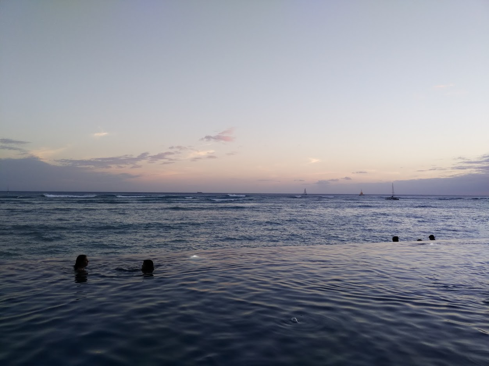

吹了一阵夜里的海风之后惬意满满。回家路上感觉实在是走不动了，正好有个在休息的的士司机把出租车停在这沙滩出来往马路去的地方。于是就上车回家。一路上司机师傅侃侃而谈。还给了个名片，说迷路了找我准没错。其实我知道他带着我们绕了不少路。看他块头好大就不跟他计较了。他还推荐了最佳早餐餐厅，专门吃pancake的店。给了他20美金然后赶紧上楼。感觉不太确定老美司机的热情是不是真的，怕再被他拉上车去兜夜里的夏威夷，收下的名片后来也不知所踪。反正我们自己开车有谷歌地图导航我不怕，哈哈。

总结这一天:
初来乍到。车不习惯，路不习惯，但是很快便适应了。
午餐$35，晚餐$55，在Waikiki路边的店随便买了些早餐和零食$23.2，晚上从Waikiki海滩打车回来绕了路花了$20。之后有天晚上又开车来了一次市区的海滩。到家之后洗澡休息，明天一早要去恐龙湾潜水。三人很快入睡。

### 第二天5月6日
插播：之前的日志都是在Rstudio裏面完成的，然而Rstudio至今沒有解決fcitx下中文/日語輸入法的問題，外事不決問google之後發現了名叫Atom的markdown編輯器，於是今後就開始用Atom編輯博客內容咯。

上回說到了夏威夷第一日初來乍到路況不熟，我們第二日一早6點多便起牀上車，一路沿着美麗的沿海高速公路衝向期待已久的[恐龍灣Hanauma Bay](http://hanaumabaystatepark.com/)。先感嘆一句，這海真的很贊。

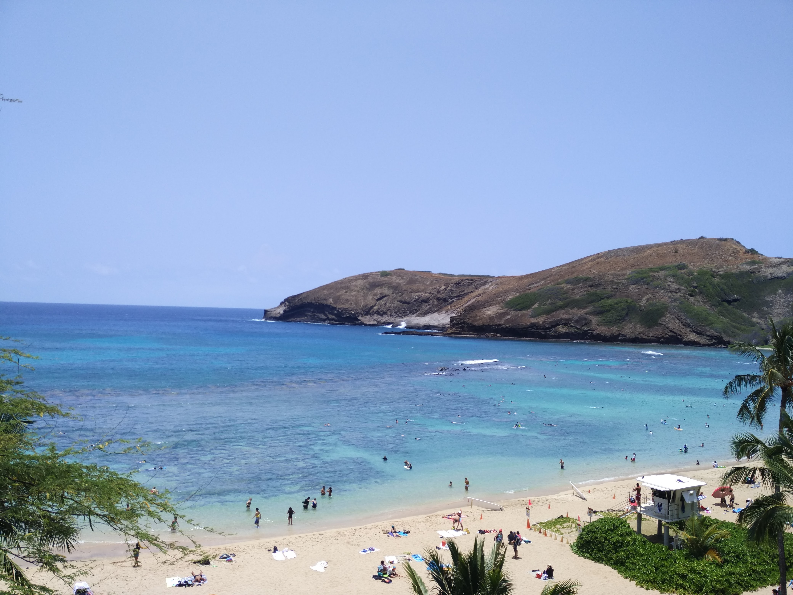

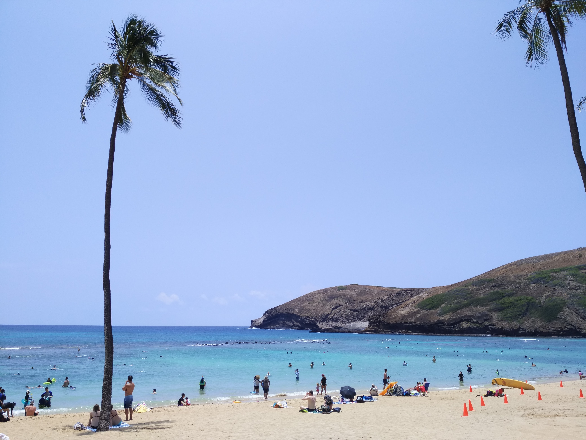

從高處看藍得讓人心醉。到了沙灘前只見水清見底，那句“水至清則無魚”其實到此便失去了意義，看那水中明明就有各式各樣的熱帶魚在清水中擺尾，自如的遊動。非常愜意。

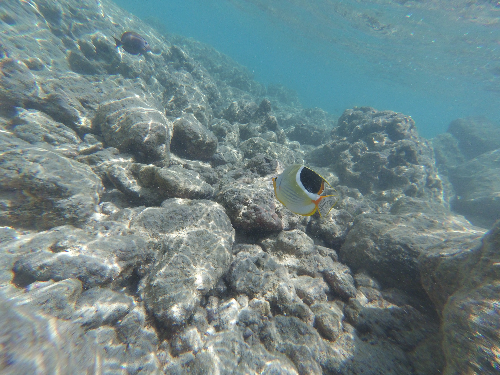

因爲帶着1歲半的小熊寶，我們倆只能輪流下海浮潛。新買的小蟻相機的水下拍攝效果的確不錯，快看我在水裏的自拍：

<iframe src="https://player.vimeo.com/video/174630873?color=c9ff23" width="640" height="360" frameborder="0" webkitallowfullscreen mozallowfullscreen allowfullscreen></iframe>

<a href="https://vimeo.com/174630873">Myself in Hawaii diving</a>

還有我拍的水下影像a：  

<iframe src="https://player.vimeo.com/video/174633391?color=c9ff23" width="640" height="360" frameborder="0" webkitallowfullscreen mozallowfullscreen allowfullscreen></iframe>

水下影像b：  
<iframe src="https://player.vimeo.com/video/174633461?color=c9ff23" width="640" height="360" frameborder="0" webkitallowfullscreen mozallowfullscreen allowfullscreen></iframe>

接下來要放我兒子的視頻了：  
<iframe src="https://player.vimeo.com/video/174633496?color=c9ff23" width="640" height="1136" frameborder="0" webkitallowfullscreen mozallowfullscreen allowfullscreen></iframe>

看他光光的小腿邁入大海時純淨爽朗開心的笑聲，是不是非常的治愈？
